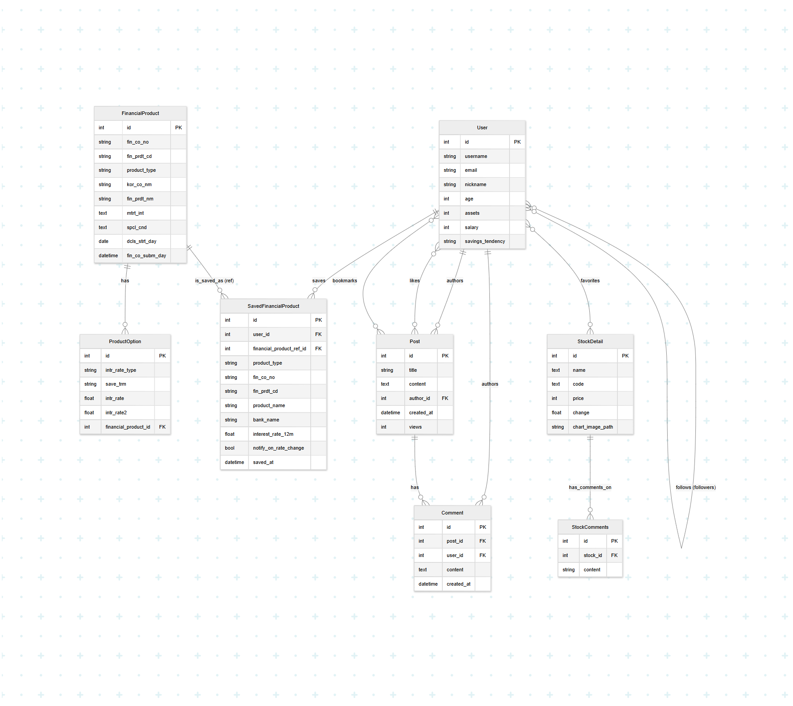

# FinScope 프로젝트

FinScope는 사용자 맞춤형 금융 정보 제공 및 커뮤니티 기능을 통합한 웹 서비스입니다. 사용자는 예적금 상품 비교, 주식 정보 조회, 금융 뉴스 열람, AI 기반 금융 상품 추천 등 다양한 기능을 활용할 수 있습니다.

## 목차
- [FinScope 프로젝트](#finscope-프로젝트)
  - [목차](#목차)
  - [1. 팀원 정보 및 업무 분담 내역](#1-팀원-정보-및-업무-분담-내역)
  - [2. 설계 내용(아키텍처 등) 및 실제 구현 정도](#2-설계-내용아키텍처-등-및-실제-구현-정도)
    - [아키텍처](#아키텍처)
    - [실제 구현 정도](#실제-구현-정도)
  - [3. 데이터베이스 모델링(ERD)](#3-데이터베이스-모델링erd)
  - [4. 금융 상품 추천 알고리즘에 대한 기술적 설명](#4-금융-상품-추천-알고리즘에-대한-기술적-설명)
  - [5. 서비스 대표 기능들에 대한 설명](#5-서비스-대표-기능들에-대한-설명)
  - [6. 생성형 AI 를 활용한 부분](#6-생성형-ai-를-활용한-부분)
  - [7. 기타(느낀 점, 후기 등)](#7-기타느낀-점-후기-등)

## 1. 팀원 정보 및 업무 분담 내역

*   **김범주**: Frontend, Backend 개발
    *   Vue.js를 사용한 프론트엔드 전체 개발
    *   Django REST framework를 사용한 백엔드 API 개발 일부 담당
    *   AI 기능 연동 (Gemini API 활용)
*   **이재익**: Backend 개발
    *   Django REST framework를 사용한 백엔드 API 개발 주요 담당
    *   데이터베이스 모델링 및 관리

## 2. 설계 내용(아키텍처 등) 및 실제 구현 정도

### 아키텍처
*   **Frontend**: Vue.js (Vite 기반), Pinia (상태 관리), Axios (HTTP 통신), Tailwind CSS (스타일링)
*   **Backend**: Django, Django REST framework (API 제공), SQLite (개발용 데이터베이스)
*   **AI**: Google Gemini API (금융 상품 추천, 유튜브 영상 요약)

### 실제 구현 정도
*   **사용자 인증**: 회원가입, 로그인 (일반, 소셜 - Kakao, Naver, Google), 로그아웃, 마이페이지 (프로필 수정, 활동 내역) 기능 구현 완료.
*   **금융 상품 정보**:
    *   예적금 상품 정보 조회 및 비교 기능 구현 완료.
    *   주식 정보 조회 (차트 - 일/월/년, 관련 뉴스, 관련 유튜브 영상) 기능 구현 완료.
    *   환율 정보, 주요 원자재 가격 정보 조회 기능 구현 완료.
    *   은행 위치 정보 (지도 연동) 기능 구현 완료.
*   **AI 추천**:
    *   사용자 프로필(나이, 연봉, 투자 성향) 기반 AI 금융 상품 (예적금, 주식) 추천 기능 구현 완료.
    *   추천 결과 저장 및 마이페이지에서 조회 기능 구현 완료.
    *   유튜브 영상 요약 기능 (Gemini API 연동) 구현 완료.
*   **커뮤니티 (게시판)**: 게시글 CRUD, 댓글 CRUD, 좋아요, 북마크 기능 구현 완료.
*   **북마크 기능**: 게시글, 유튜브 영상 북마크 및 마이페이지에서 조회 기능 구현 완료. (주식 북마크는 현재 비활성화)

## 3. 데이터베이스 모델링(ERD)

본 프로젝트의 데이터베이스 모델링(ERD)은 아래와 같습니다.



**주요 모델:**
*   `User`: 사용자 정보 (AbstractUser 확장), 프로필 정보 (나이, 자산, 연봉, 투자 성향)
*   `Post`: 게시글 정보 (제목, 내용, 작성자, 작성일, 조회수, 좋아요, 북마크)
*   `Comment`: 댓글 정보 (게시글, 사용자, 내용, 작성일)
*   `StockDetail`: 주식 상세 정보 (이름, 코드 등) - 현재 북마크 기능은 비활성화됨
*   `SavedFinancialProduct`: 사용자가 저장한 예적금 상품 정보
*   `BookmarkedVideo`: 사용자가 북마크한 유튜브 영상 정보
*   `SavedAiRecommendation`: 사용자가 저장한 AI 추천 포트폴리오 정보

## 4. 금융 상품 추천 알고리즘에 대한 기술적 설명

본 서비스의 금융 상품 추천은 Google의 Gemini API를 활용하여 구현되었습니다.

1.  **사용자 정보 수집**: 사용자의 프로필에 저장된 나이, 연봉, 자산(선택적), 투자 성향(`investment_tendency`) 정보를 사용합니다.
2.  **금융 상품 데이터**: `financial_products.json` 파일에 저장된 예적금 상품 목록 및 일부 주식 정보를 기반 데이터로 활용합니다.
3.  **프롬프트 엔지니어링**:
    *   수집된 사용자 정보와 금융 상품 데이터를 포함하여 Gemini API에 전달할 프롬프트를 구성합니다.
    *   프롬프트는 사용자 성향에 맞춰 예적금 상품 최소 3개를 포함하여 총 10개의 금융 상품으로 포트폴리오를 구성하도록 요청합니다.
    *   응답 형식을 특정 JSON 배열 구조로 제한하여 API가 일관된 결과를 반환하도록 유도합니다.
    ```
    [
      {"name": "상품/주식명", "type": "deposit" or "stock"},
      ...
    ]
    ```
4.  **API 호출 및 결과 처리**:
    *   Django 백엔드에서 `google-generativeai` 라이브러리를 사용하여 Gemini API (`gemini-2.5-pro-preview-05-06` 모델)를 호출합니다.
    *   API로부터 받은 텍스트 응답에서 JSON 배열 부분을 추출하고 파싱하여 프론트엔드에 전달합니다.
    *   오류 발생 시 (예: 금융 데이터 파일 누락, API 응답 형식 오류) 적절한 에러 메시지를 반환합니다.

이러한 과정을 통해 사용자에게 개인화된 금융 상품 포트폴리오를 추천합니다.

## 5. 서비스 대표 기능들에 대한 설명

*   **AI 금융 상품 추천**: 사용자의 프로필(나이, 연봉, 투자 성향)을 기반으로 Gemini AI가 예적금 및 주식 상품으로 구성된 맞춤형 포트폴리오를 추천합니다. 사용자는 이 추천을 저장하고 마이페이지에서 다시 확인할 수 있습니다.
*   **주식 정보 조회**: 국내외 주식 검색, 주가 차트(일/월/년 단위), 관련 최신 뉴스, 관련 유튜브 영상 목록을 제공합니다. 유튜브 영상의 경우 Gemini API를 통해 영상 스크립트를 요약하여 제공합니다.
*   **예적금 상품 비교**: 다양한 금융기관의 예금 및 적금 상품 정보를 비교하여 보여주고, 사용자가 원하는 상품을 저장할 수 있습니다.
*   **커뮤니티 게시판**: 사용자들이 금융 관련 정보를 공유하고 소통할 수 있는 게시판 기능을 제공합니다. 게시글 작성, 수정, 삭제, 댓글 작성, 좋아요 및 북마크 기능을 지원합니다.
*   **마이페이지**: 사용자 프로필 관리, 작성한 글/댓글 모아보기, 저장한 금융 상품, 북마크한 유튜브 영상 및 게시글, 저장된 AI 추천 포트폴리오를 확인할 수 있습니다.
*   **소셜 로그인**: Kakao, Naver, Google 계정을 통한 간편 로그인을 지원합니다.
*   **기타 금융 정보**: 주요 원자재(금, 은, 유가) 시세 및 주요 통화 환율 정보를 제공합니다.

## 6. 생성형 AI 를 활용한 부분

본 프로젝트에서는 다음과 같이 생성형 AI (Google Gemini API)를 적극적으로 활용하였습니다:

1.  **금융 상품 추천**:
    *   사용자의 프로필(나이, 연봉, 투자 성향 등)과 시스템에 등록된 금융 상품 목록(예적금, 주식)을 기반으로 Gemini API가 개인 맞춤형 포트폴리오를 추천합니다.
    *   복잡한 조건(예: 예적금 최소 포함 개수, 총 추천 개수)과 정해진 JSON 출력 형식을 프롬프트에 명시하여 AI가 유용한 형태로 결과를 생성하도록 유도했습니다.

2.  **유튜브 영상 요약**:
    *   주식 정보 페이지에서 관련 유튜브 영상을 보여줄 때, 해당 영상의 스크립트를 추출합니다 (`youtube-transcript-api` 라이브러리 사용).
    *   추출된 스크립트를 Gemini API에 전달하여 영상의 주요 내용을 간결하게 요약한 정보를 사용자에게 제공합니다. 이를 통해 사용자는 영상을 시청하기 전에 빠르게 핵심 내용을 파악할 수 있습니다.

3.  **개발 과정에서의 AI 활용 (Cline - Model Context Protocol)**:
    *   본 프로젝트의 개발 과정 중 일부는 코드 생성 및 문제 해결을 위해 AI 개발 도우미(Cline)와 함께 진행되었습니다.
    *   특히, 복잡한 로직 구현, API 연동, 디버깅 과정에서 AI의 도움을 받았으며, 이는 Model Context Protocol (MCP)을 통해 개발 환경과 AI 모델 간의 효율적인 정보 교환을 기반으로 이루어졌습니다. 이를 통해 개발 생산성을 높이고 다양한 아이디어를 빠르게 프로토타이핑할 수 있었습니다.

## 7. 기타(느낀 점, 후기 등)

본 프로젝트를 진행하면서 팀원들은 다음과 같은 점들을 배우고 느꼈습니다.

*   **AI 개발 도구(MCP 및 Cline)의 효용성과 학습자로서의 자세**:
    *   개발 과정에서 Model Context Protocol (MCP) 기반의 AI 개발 도우미(Cline)를 활용하면서 코드 생성, 디버깅, 복잡한 로직 구현에 있어 AI의 강력한 지원을 경험할 수 있었습니다. 이를 통해 개발 생산성을 크게 향상시키고, 다양한 기능을 빠르게 프로토타이핑하며 아이디어를 구체화하는 데 큰 도움을 받았습니다.
    *   동시에, AI가 생성한 코드를 맹목적으로 수용하기보다는 비판적으로 검토하고 이해하려는 노력이 중요함을 깨달았습니다. 학습자로서 AI를 유용한 도구로 활용하되, 기술의 원리를 깊이 이해하고 스스로 문제를 해결하는 능력을 기르는 것이 장기적인 성장에 필수적임을 느꼈습니다.

*   **시간 관리의 중요성**:
    *   프로젝트 마감 기한이 정해져 있는 상황에서, 각 기능 구현에 필요한 시간을 예측하고 일정을 관리하는 능력의 중요성을 절실히 깨달았습니다.
    *   체계적인 계획 수립과 꾸준한 진행 상황 점검을 통해 효율적으로 시간을 분배하고, 예기치 않은 문제 발생 시 유연하게 대처하는 능력을 기를 수 있었습니다.

*   **협업과 소통의 가치**:
    *   본 프로젝트는 팀원 간의 첫 공식 협업 경험이었습니다. 이 과정에서 명확하고 지속적인 소통이 프로젝트 성공의 핵심임을 배웠습니다.
    *   업무 분담, 진행 상황 공유, 문제 발생 시 공동 대응 등 모든 단계에서 긴밀한 소통을 통해 오해를 줄이고 시너지를 창출할 수 있었습니다. 특히, 각자의 강점을 활용하고 서로의 부족한 부분을 보완하며 함께 성장하는 협업의 즐거움을 느낄 수 있었습니다.

앞으로도 이러한 경험을 바탕으로 더욱 발전된 프로젝트를 수행할 수 있도록 노력할 것입니다.

---

